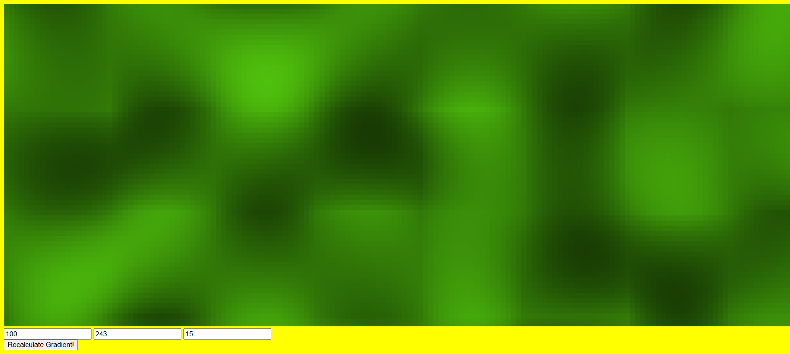

# Overview
This program creates a gradient for you using perlin noise
Simply enter a background colour and see a gradient created between the colour you entered and black

# How to use
* First go to: https://thesupernile.github.io/PerlinColours/
* Then fill out the three boxes. These are the RGB of the colour in your gradient!
* Click recalculate gradient and see the final result!

# Screenshots

Screenshot of main page showing a generated perlin gradient
