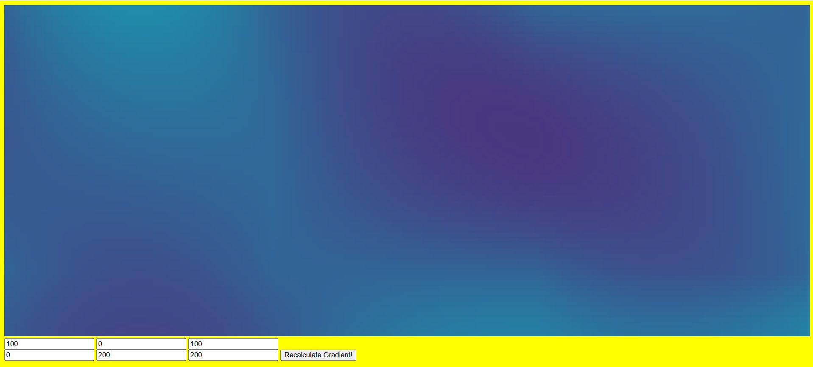
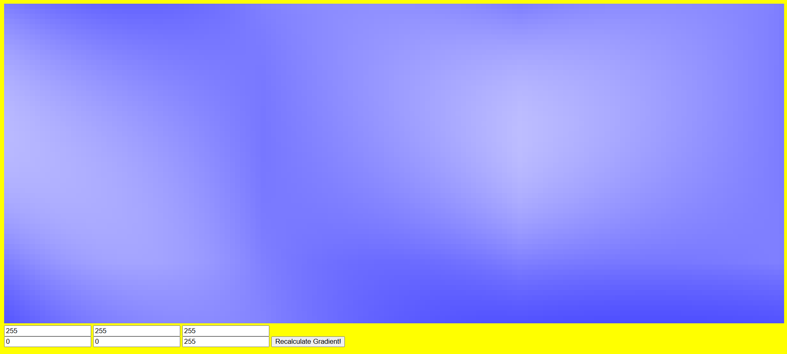
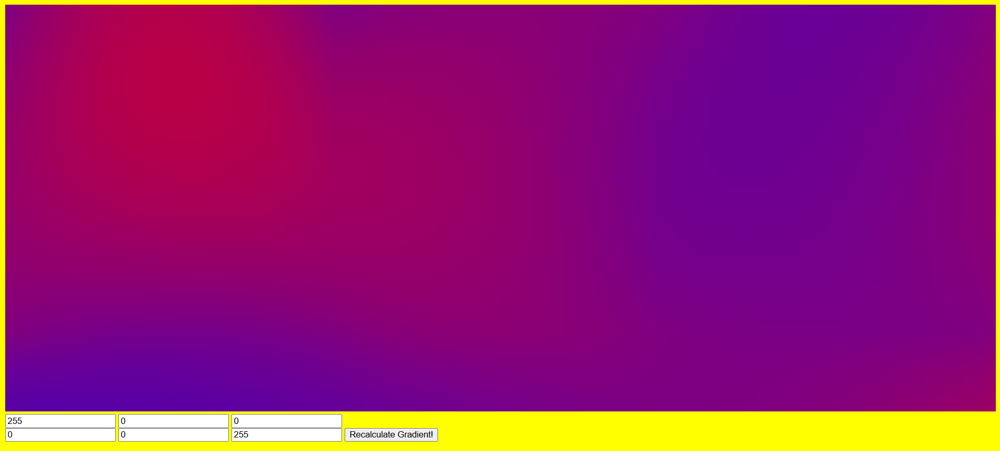

# Overview
This program creates a gradient for you using perlin noise
Simply enter a two colours and see a gradient created between the two colours that you entered

# How to use
* First go to: https://thesupernile.github.io/PerlinColours/
* Then fill out the three boxes. These are the RGB of the colour in your gradient!
* Click recalculate gradient and see the final result!

# Screenshots

The following three images show different gradients generated using this tool:

