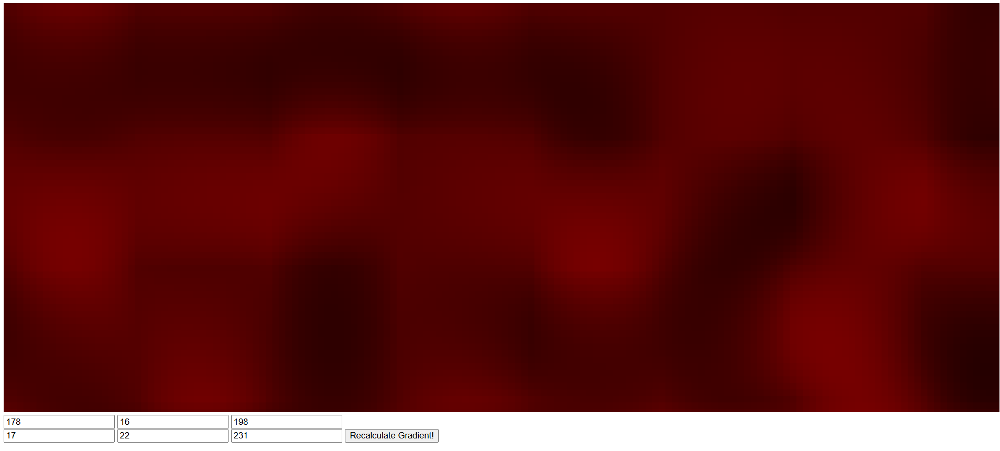

# Overview
This program creates a gradient for you using perlin noise

# How to use
* First go to: 
* Then fill out the six boxes. These are the RGB of the first and second colour in your gradient!
* Click calculate gradient and see the final result!

# Screenshots

